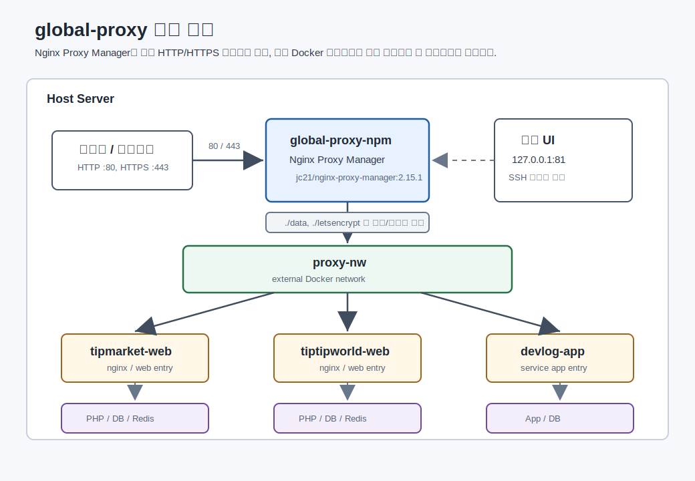

# 받기 전에 

1. git 설치
```bash
# 패키지 목록 업데이트
sudo apt update

# Git 설치
sudo apt install git -y

# 설치 확인 및 버전 체크
git --version

# 사용자 이름 설정
git config --global user.name "YourName"

# 사용자 이메일 설정
git config --global user.email "your-email@example.com"

# 설정 확인
git config --list

git config --global init.defaultBranch main
```

2. docker 설치
```bash

## 필수 패키지 설치 및 저장소 등록 (Docker 공식 저장소를 추가하기 위해 필요한 도구들을 먼저 설치)
sudo apt update
sudo apt install -y ca-certificates curl gnupg lsb-release

# Docker 공식 GPG 키 추가
sudo mkdir -p /etc/apt/keyrings
curl -fsSL https://download.docker.com/linux/debian/gpg | sudo gpg --dearmor -o /etc/apt/keyrings/docker.gpg

# 저장소 설정
echo \
  "deb [arch=$(dpkg --print-architecture) signed-by=/etc/apt/keyrings/docker.gpg] https://download.docker.com/linux/debian \
  $(lsb_release -cs) stable" | sudo tee /etc/apt/sources.list.d/docker.list > /dev/null

## Docker 엔진 설치
sudo apt update
sudo apt install -y docker-ce docker-ce-cli containerd.io docker-compose-plugin


## 사용자 권한 설정 (sudo 없이 Docker를 사용하기 위해 현재 사용자를 docker 그룹에 추가)
sudo usermod -aG docker $USER

## WSL2 에서 Docker 서비스 실행
# Docker 서비스 시작
sudo service docker start

# 실행 확인
docker ps

## 자동 실행 설정
sudo nano /etc/wsl.conf

# 아래 내용 추가
[boot]
systemd=true

# wsl 재시작 

```

# git으로 받고 나서 해야 할 것
터미널에서 명령어
```bash
cd infrastructure
mkdir services
cd global-proxy
docker compose version
docker --version
docker compose pull
docker network inspect proxy-nw >/dev/null 2>&1 || docker network create proxy-nw
docker compose up -d
docker network ls | grep proxy-nw
```

`proxy-nw`는 `global-proxy`와 각 서비스 컨테이너가 함께 사용하는 공용 Docker 네트워크이다. `global-proxy/docker-compose.yml`에서 `external: true`로 참조하므로, 네트워크가 없으면 `docker compose up -d`가 실패한다. 위 명령은 이미 `proxy-nw`가 있으면 그대로 사용하고, 없을 때만 새로 만든다.

## 서버 구조



`global-proxy`는 서버의 공개 웹 진입점이다. 외부 사용자의 HTTP `:80` 요청과 HTTPS `:443` 요청은 먼저 `global-proxy-npm` 컨테이너로 들어오고, Nginx Proxy Manager의 도메인별 프록시 설정에 따라 `proxy-nw`에 연결된 서비스 컨테이너로 전달된다.

```text
사용자 / 브라우저
  -> Host Server :80 / :443
  -> global-proxy-npm
  -> proxy-nw
  -> tipmarket-web / tiptipworld-web / devlog-app ...
  -> 서비스별 내부 네트워크
  -> app / db / redis 등
```

서비스 컨테이너는 필요한 경우 두 종류의 네트워크를 함께 사용한다. `proxy-nw`는 `global-proxy`가 접근하는 공용 진입 네트워크이고, `서비스명_internal` 형태의 내부 네트워크는 각 서비스의 `app`, `web`, `db`, `redis` 같은 컨테이너가 서로 통신하는 전용 네트워크이다. 외부 트래픽은 보통 `global-proxy-npm -> proxy-nw -> 서비스 웹 컨테이너`까지만 직접 들어오고, DB나 Redis는 서비스 내부 네트워크에만 둔다.

`global-proxy/docker-compose.yml`의 `./data:/data`에는 Nginx Proxy Manager 설정과 사용자 정보가 저장되고, `./letsencrypt:/etc/letsencrypt`에는 Let's Encrypt SSL 인증서가 저장된다. 컨테이너를 다시 만들더라도 이 디렉터리를 유지하면 프록시 설정과 인증서를 계속 사용할 수 있다.

## global-proxy 관리 UI 접속

Nginx Proxy Manager 관리 UI는 공개 인터넷에 노출하지 않는다. `global-proxy/docker-compose.yml`의 관리 포트는 로컬 루프백에만 바인딩한다.

```yaml
ports:
  - "127.0.0.1:81:81"
```

관리 UI에 접속할 때는 SSH 터널을 사용한다.

```bash
ssh -L 8181:127.0.0.1:81 <server-ssh-user>@<global-proxy-server-ip-or-domain>
```

`<server-ssh-user>`는 `global-proxy`가 실행 중인 서버의 SSH 사용자이고, `<global-proxy-server-ip-or-domain>`은 해당 서버의 IP 또는 도메인이다. 이 명령은 내 로컬 PC의 `127.0.0.1:8181`을 `global-proxy` 서버 내부의 `127.0.0.1:81`로 연결한다.

터널 연결 후 로컬 브라우저에서 아래 주소로 접속한다.

```text
http://127.0.0.1:8181
```

`81`번 포트는 `0.0.0.0`에 직접 열지 않는다. VPN/내부망 직접 공개나 관리 도메인 프록시는 별도 보안 정책을 정한 뒤에만 검토한다.

### Windows PowerShell에서 접속

Windows PowerShell에서 OpenSSH 클라이언트가 설치되어 있는지 확인한다.

```powershell
ssh -V
```

명령이 동작하지 않으면 Windows 설정에서 `선택적 기능 > 기능 보기 > OpenSSH Client`를 설치한다.

PowerShell에서 아래 명령으로 SSH 터널을 연다.

```powershell
ssh -L 8181:127.0.0.1:81 <server-ssh-user>@<global-proxy-server-ip-or-domain>
```

예시는 아래와 같다.

```powershell
ssh -L 8181:127.0.0.1:81 ubuntu@203.0.113.10
```

SSH 키 파일을 직접 지정해야 하면 `-i` 옵션을 사용한다.

```powershell
ssh -i "$env:USERPROFILE\.ssh\id_ed25519" -L 8181:127.0.0.1:81 <server-ssh-user>@<global-proxy-server-ip-or-domain>
```

터널 명령을 실행한 PowerShell 창은 닫지 않는다. 로그인된 상태로 유지되어야 터널도 유지된다.

터널이 열린 상태에서 Windows 브라우저로 아래 주소에 접속한다.

```text
http://127.0.0.1:8181
```

접속이 끝나면 PowerShell 창에서 `Ctrl+C`를 눌러 터널을 종료한다.

설정이 의도대로 해석되는지 확인한다.

```bash
docker compose -f global-proxy/docker-compose.yml config
```

서버에서 관리 포트가 루프백에만 바인딩되어 있는지 확인한다.

```bash
ss -ltnp | grep ':81'
```

그 후 services폴더로 들어가서 각각 프로젝트를 git으로 다운받는다.
