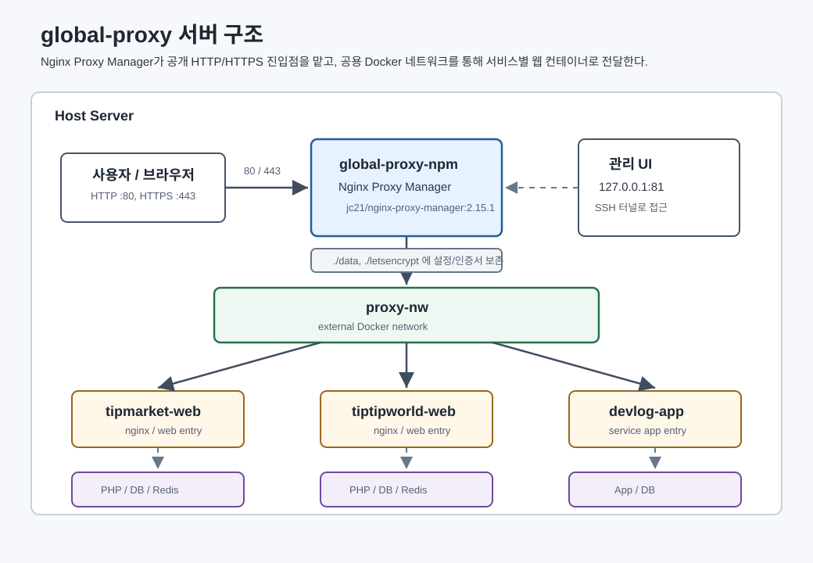

# Infrastructure

`global-proxy`와 개별 서비스 컨테이너로 구성된 서버 인프라 저장소이다.

## 서버 구조

## 문서 안내

| 분류 | 주요 내용 | 상세 문서 |
| --- | --- | --- |
| 사전 요구사항 | Git, Docker 설치와 WSL2 설정 | [환경 준비](docs/prerequisites.md) |
| 최초 설치 | 저장소 준비, 공용 네트워크 생성, `global-proxy` 실행 | [설치 가이드](docs/installation.md) |
| 아키텍처 | 외부 요청 흐름, Docker 네트워크, 데이터 영속화 | [아키텍처](docs/architecture.md) |
| 포함 서비스 | 인프라에 포함되는 개별 서비스 목록과 역할 | [서비스 목록](docs/services.md) |
| 운영 | 관리 UI 접속, Windows SSH 터널, 설정 검증 | [운영 가이드](docs/operations.md) |
| 보안 | 관리 포트, SSH 터널, 내부 네트워크 보안 원칙 | [보안 지침](docs/security.md) |
